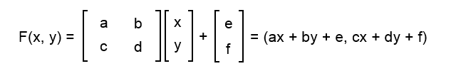
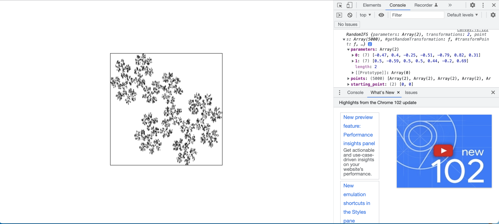
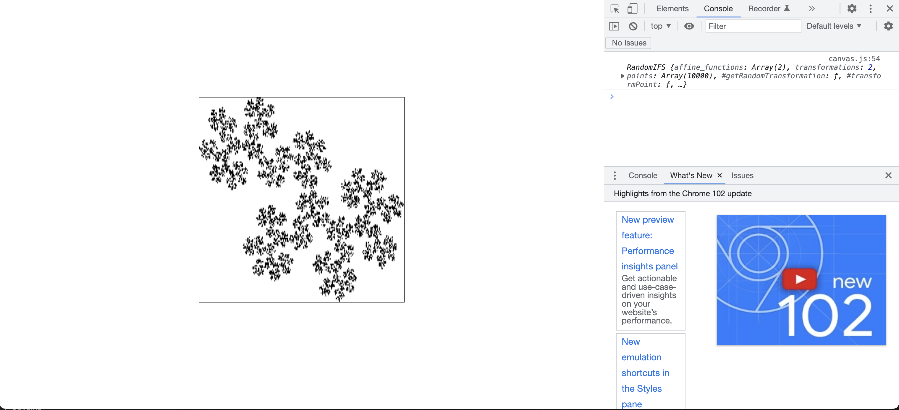
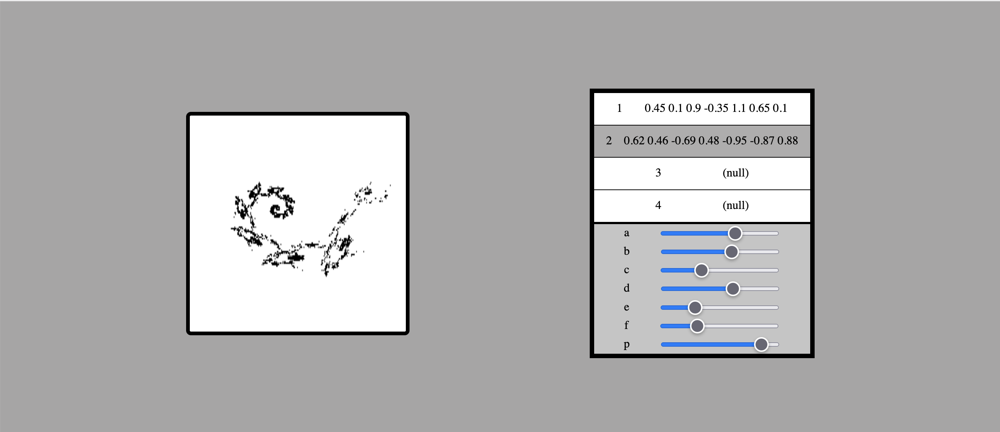

# Iterated Function System Project

## Goal

to implement an interactive app where users can generate and share images generated from an iterated function system (IFS)

## What's an IFS?

An IFS is a process that transforms points from $\mathbb{R^2} \to \mathbb{R^2}$ using affine functions that each have a designated probability of being selected.


Formula for an affine transformation.

> An affine function is the composition of a linear function with a translation.
> [Math Stack Exchange](https://math.stackexchange.com/questions/275310/what-is-the-difference-between-linear-and-affine-function)

## Background

I built a project on this 4 years ago, and now I'm going to expand on this by building something for my portfolio. I'm going to try and document everything I do, however, for future clarification.

# Jun 12, 2022

## sometime late at night/early in the morning

> The most common algorithm to compute IFS fractals is called the "chaos game". It consists of picking a random point in the plane, then iteratively applying one of the functions chosen at random from the function system to transform the point to get a next point.
> [Wikipedia](https://en.wikipedia.org/wiki/Iterated_function_system#Constructions)

I think my first goal will be to design a system that handles the generation of the points for IFS. Then client-side I can determine which points which fall within the boundaries of the size of the container I choose and render them, which brings the first question:

# How the f\*\*\* do I draw on the screen?

Seriously, I have no clue.
Which means... to the docs!

## Canvas API

> The Canvas API provides a means for **drawing graphics** via JavaScript and the HTML `<canvas>` element. Among other things, it can be used for animation, game graphics, data visualization, photo manipulation, and real-time video processing.

Seems like a good place to start.

But, honestly, before this, I'm going to map out how I will implement an API for this system.

## 6:18am

# RandomIFS

The `RandomIFS` class has the following fields:

- \+ `affine_functions: float[7][]`
- \+ `points: float[2][]`
- \+ `starting_point: float[2]`
- \+ `map_bounds: Object`
- \- `transformations: number`

and the following methods:

- \+ `generate(n, offset=0): float[2][]`
- \- `getRandomTransformation(): float[6]`
- \- `transformPoint(): float[2]`

The interface for `RandomIFS` is as follows:

```
properties = {
    affine_functions: [
        [-0.47, 0.4, -0.25, -0.51, -0.79, 0.82, 0.31],
        [0.5, -0.59, 0.5, 0.5, 0.44, -0.2, 0.69],
    ],
    starting_point: [1, 1]
}
```

If a starting point is not specified the default is $[0, 0]$.

In `generate(n)`, `RandomIFS` uses the previous point to generate a next point by the following process:

1. choose a random transformation (`getRandomTransformation()`)

- this is done by looping over each transformation and stopping only if a uniform random number generated on each step is less than that transformation's probablility of being chosen

2. generate the next point by transforming the current one (`transformPoint()`)
3. add the point to the array, if past the offset

Then I will handle readjusting to the data to the screen dimensions in another component, since $(x, y)$ for screens is different than $\mathbb{R^2}$.

## 6:53am

Now to design the test playground.

### Step 1: Create a flexible centered div in the viewport.

This is accomplished using

```
<div class="container">
    <div class="demo"></div>
</div>
```

in `index.html` and

```
.container {
  display: flex;
  justify-content: center;
  align-items: center;

  width: 100%;
  height: 100vh;
}

.demo {
  width: min(50vw, 50vh);
  height: min(50vw, 50vh);

  border: 1px solid black;
}
```

in `style.css`.

### Step 2: Fill the container with random dots.

First, I created a `<canvas>` within `demo`.
Next, I used the following code from the [Canvas API](https://developer.mozilla.org/en-US/docs/Web/API/Canvas_API) to draw a green rectangle and observe its behavior:

```
const canvas = document.getElementById("canvas");
const ctx = canvas.getContext("2d");

ctx.fillStyle = "green";
ctx.fillRect(10, 10, 40, 40);
```

I put this into a file named `canvas.js` and used `defer` to ensure it loaded after the DOM.
The result is the rectangle dynamically scales with the webpage.

Next I changed the code to

```
ctx.fillStyle = "black";
ctx.fillRect(x, y, 1, 1);
```

where

```
x = Math.floor(Math.random() * domRect.width);
y = Math.floor(Math.random() * domRect.height);
```

And looped over `fillRect` 1000 times to test; looks good.

Now I will import `RandomIFS` for testing.

## 7:35am

~~Moved everything in `RandomIFS.js` over to `canvas.js` because I was getting SyntaxErrors regarding the imports.~~

Here is the `index.html` file with all imports.

```
<!DOCTYPE html>
<html lang="en">
  <head>
    <meta charset="UTF-8" />
    <meta http-equiv="X-UA-Compatible" content="IE=edge" />
    <meta name="viewport" content="width=device-width, initial-scale=1.0" />
    <link rel="stylesheet" href="style.css" />
    <script src="RandomIFS.js"></script>
    <script defer src="canvas.js"></script>
    <title>RandomIFS playground</title>
  </head>
  <body>
    <div class="container">
      <div class="demo">
        <canvas id="canvas"></canvas>
      </div>
    </div>
  </body>
</html>
```

Seems like `RandomIFS` is generating points okay, time to translate them.

# Translating $\mathbb{R^2}$ to screen coordinates

## Found a weird bug in the playground

When I tried to scale the random points to be in one-quarter of the canvas, it didn't scale right. After some experimentation it seems the canvas object w.r.t. drawing has a fixed width and height of 300 and 150 (I have labeled these coefficients `CANVAS_WIDTH` and `CANVAS_HEIGHT`, and these two coefficients replace `domRect.width` and `domRect.height`).

## The code that scales stuff

```
function translateCoords(bounds, coords) {
  const { xmin, xmax, ymin, ymax } = bounds;
  const [x, y] = coords;
  const containerX = (CANVAS_WIDTH / (xmax - xmin)) * (x - xmin);
  const containerY = (-CANVAS_HEIGHT / (ymax - ymin)) * (y - ymax);

  return [containerX, containerY];
}
```

where `xmin, xmax, ymin, ymax` are bounds of points generated from `RandomIFS`.
<span style="color:red">need to explain this code</span>

## 9:06am

Final result:


## 10:14am

Playing with implements of dot drawing: `createImageData()` vs `fillRect()`

`createImageData()` is cleaner but takes a lil bit longer, probably worth it tbh


# 12:14 PM

Time to start making the controls feature. Last feature then I should take a nap.

So far I have built a list of divs containing a slider and its name as follows:

```
<div class="controls">
    <div class="div_slider">
        <span>a</span>
        <input
        id="a"
        type="range"
        min="-2"
        max="2"
        step="0.05"
        value="0"
        onchange="broadcastA()"
        />
    </div>
    <div class="div_slider">
        <span>b</span>
        <input
        id="b"
        type="range"
        min="-2"
        max="2"
        step="0.05"
        value="0"
        onchange="broadcastB()"
        />
    </div>
    ...
```

<span style='color: red'>I know this is a bad pattern, I'll fix this later.</span>

Here is the accompanying CSS:

```
:root {
  background-color: rgb(166, 165, 165);
}

.container {
  display: flex;
  justify-content: space-evenly;
  align-items: center;

  width: 100%;
  height: 100vh;
}

.demo {
  width: min(50vw, 50vh);
  height: min(50vw, 50vh);

  border: 5px solid black;
  border-radius: 2%;

  background-color: white;
}

#canvas {
  width: 100%;
  height: 100%;
}

.controls {
  height: 30vh;
  width: 50vh;
  border: 1px solid black;

  display: flex;
  flex-wrap: wrap;
}

.div_slider {
  display: flex;
  justify-content: space-evenly;
  align-items: center;
  width: 100%;
}
```

Next, I need to connect the inputs to the randomIFS.

5:51pm connected the inputs and now there are sliders which control the variables
and you can select which equation to highlight



**I want to add the functionality that after an adjustment the number turns green/red and transitions slowly to black in the better UI**.

But for here I think this is a good place to wrap up the generation demo. I'll spend some time documenting and refractoring everything, because after that I'm going to start designing the UI for the web app.
